# Semwal Bespoke Fabrics Catalog

Total fabrics: **307**

Use `Cmd+F` / `Ctrl+F` to search a fabric code like `I-440` or `PI-531`.

| Code | Type | Preview | File |
|---|---|---|---|
| `I-18` | Fabric | [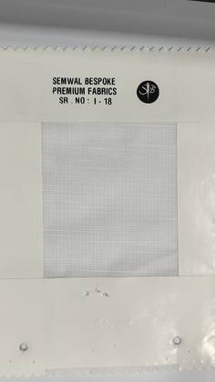](images/I-18.jpg) | [I-18.jpg](images/I-18.jpg) |
| `I-19` | Fabric | [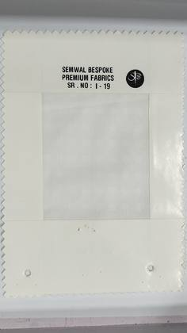](images/I-19.jpg) | [I-19.jpg](images/I-19.jpg) |
| `I-21` | Fabric | [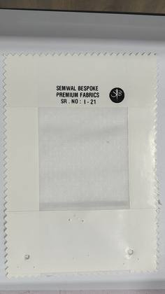](images/I-21.jpg) | [I-21.jpg](images/I-21.jpg) |
| `I-24` | Fabric | [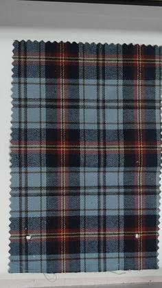](images/I-24.jpg) | [I-24.jpg](images/I-24.jpg) |
| `I-25` | Fabric | [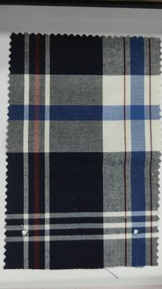](images/I-25.jpg) | [I-25.jpg](images/I-25.jpg) |
| `I-27` | Fabric | [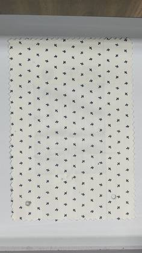](images/I-27.jpg) | [I-27.jpg](images/I-27.jpg) |
| `I-28` | Fabric | [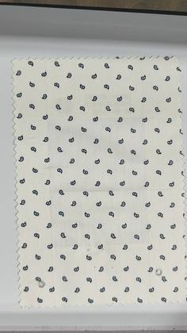](images/I-28.jpg) | [I-28.jpg](images/I-28.jpg) |
| `I-29` | Fabric | [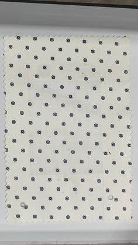](images/I-29.jpg) | [I-29.jpg](images/I-29.jpg) |
| `I-30` | Fabric | [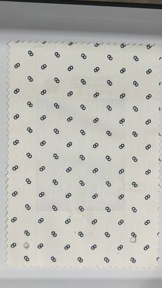](images/I-30.jpg) | [I-30.jpg](images/I-30.jpg) |
| `I-31` | Fabric | [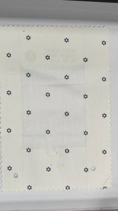](images/I-31.jpg) | [I-31.jpg](images/I-31.jpg) |
| `I-32` | Fabric | [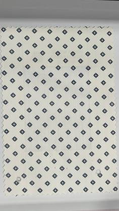](images/I-32.jpg) | [I-32.jpg](images/I-32.jpg) |
| `I-33` | Fabric | [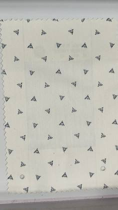](images/I-33.jpg) | [I-33.jpg](images/I-33.jpg) |
| `I-34` | Fabric | [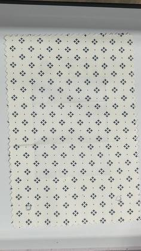](images/I-34.jpg) | [I-34.jpg](images/I-34.jpg) |
| `I-35` | Fabric | [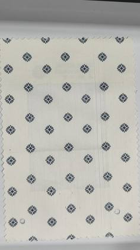](images/I-35.jpg) | [I-35.jpg](images/I-35.jpg) |
| `I-36` | Fabric | [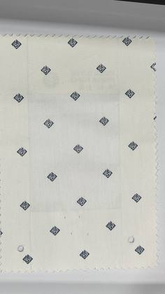](images/I-36.jpg) | [I-36.jpg](images/I-36.jpg) |
| `I-37` | Fabric | [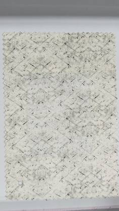](images/I-37.jpg) | [I-37.jpg](images/I-37.jpg) |
| `I-38` | Fabric | [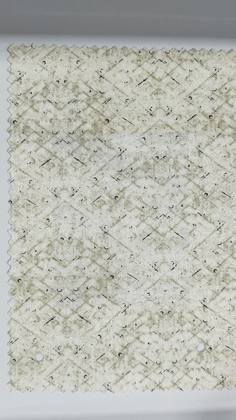](images/I-38.jpg) | [I-38.jpg](images/I-38.jpg) |
| `I-39` | Fabric | [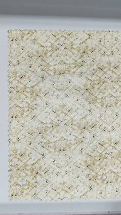](images/I-39.jpg) | [I-39.jpg](images/I-39.jpg) |
| `I-41` | Fabric | [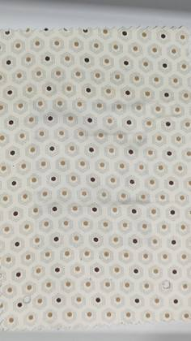](images/I-41.jpg) | [I-41.jpg](images/I-41.jpg) |
| `I-42` | Fabric | [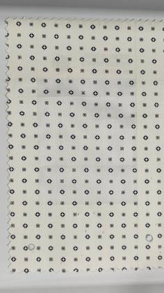](images/I-42.jpg) | [I-42.jpg](images/I-42.jpg) |
| `I-51` | Fabric | [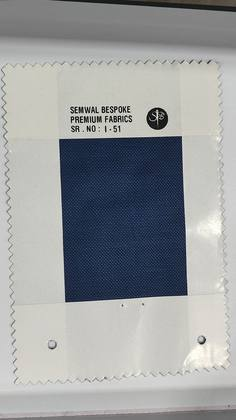](images/I-51.jpg) | [I-51.jpg](images/I-51.jpg) |
| `I-52` | Fabric | [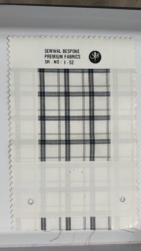](images/I-52.jpg) | [I-52.jpg](images/I-52.jpg) |
| `I-54` | Fabric | [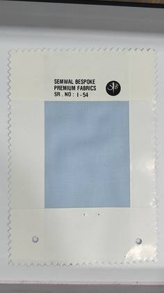](images/I-54.jpg) | [I-54.jpg](images/I-54.jpg) |
| `I-56` | Fabric | [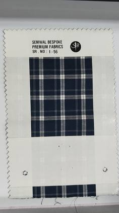](images/I-56.jpg) | [I-56.jpg](images/I-56.jpg) |
| `I-61` | Fabric | [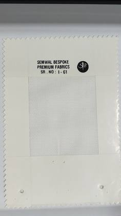](images/I-61.jpg) | [I-61.jpg](images/I-61.jpg) |
| `I-65` | Fabric | [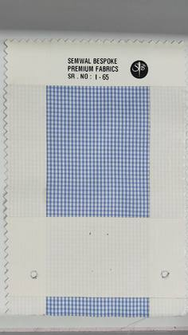](images/I-65.jpg) | [I-65.jpg](images/I-65.jpg) |
| `I-66` | Fabric | [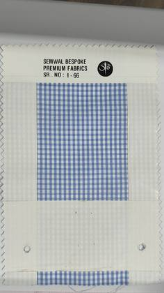](images/I-66.jpg) | [I-66.jpg](images/I-66.jpg) |
| `I-67` | Fabric | [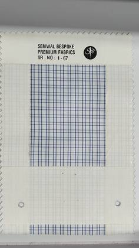](images/I-67.jpg) | [I-67.jpg](images/I-67.jpg) |
| `I-68` | Fabric | [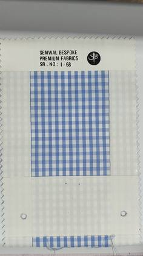](images/I-68.jpg) | [I-68.jpg](images/I-68.jpg) |
| `I-69` | Fabric | [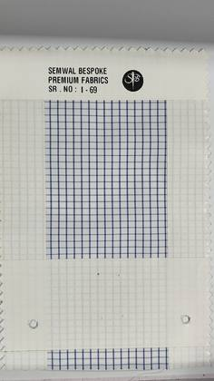](images/I-69.jpg) | [I-69.jpg](images/I-69.jpg) |
| `I-70` | Fabric | [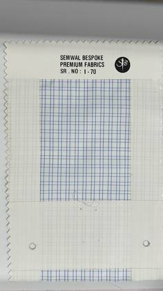](images/I-70.jpg) | [I-70.jpg](images/I-70.jpg) |
| `I-71` | Fabric | [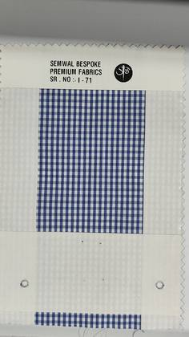](images/I-71.jpg) | [I-71.jpg](images/I-71.jpg) |
| `I-72` | Fabric | [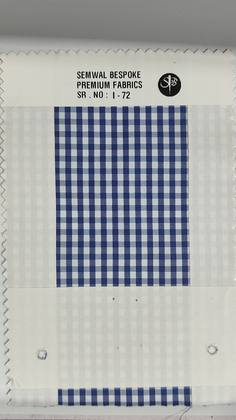](images/I-72.jpg) | [I-72.jpg](images/I-72.jpg) |
| `I-73` | Fabric | [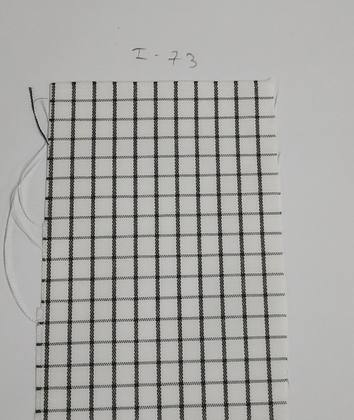](images/I-73.jpg) | [I-73.jpg](images/I-73.jpg) |
| `I-74` | Fabric | [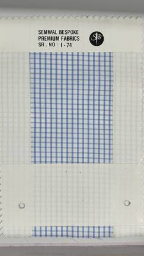](images/I-74.jpg) | [I-74.jpg](images/I-74.jpg) |
| `I-75` | Fabric | [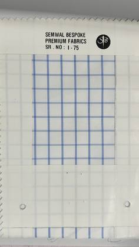](images/I-75.jpg) | [I-75.jpg](images/I-75.jpg) |
| `I-79` | Fabric | [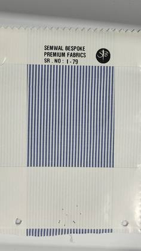](images/I-79.jpg) | [I-79.jpg](images/I-79.jpg) |
| `I-82` | Fabric | [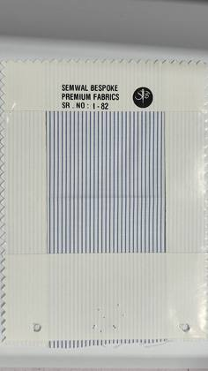](images/I-82.jpg) | [I-82.jpg](images/I-82.jpg) |
| `I-83` | Fabric | [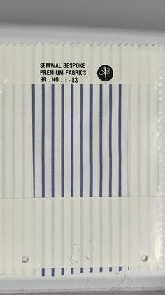](images/I-83.jpg) | [I-83.jpg](images/I-83.jpg) |
| `I-84` | Fabric | [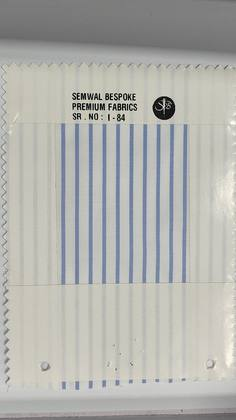](images/I-84.jpg) | [I-84.jpg](images/I-84.jpg) |
| `I-86` | Fabric | [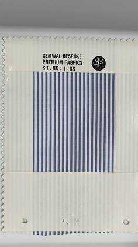](images/I-86.jpg) | [I-86.jpg](images/I-86.jpg) |
| `I-87` | Fabric | [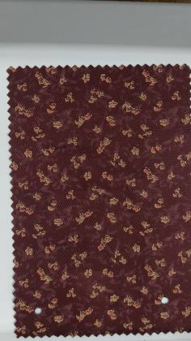](images/I-87.jpg) | [I-87.jpg](images/I-87.jpg) |
| `I-88` | Fabric | [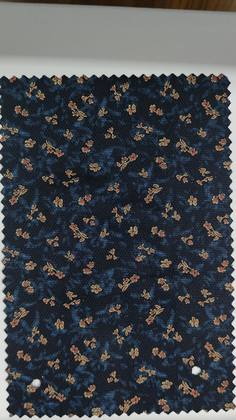](images/I-88.jpg) | [I-88.jpg](images/I-88.jpg) |
| `I-96` | Fabric | [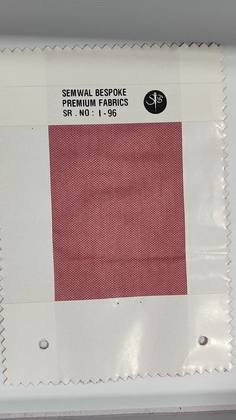](images/I-96.jpg) | [I-96.jpg](images/I-96.jpg) |
| `I-101` | Fabric | [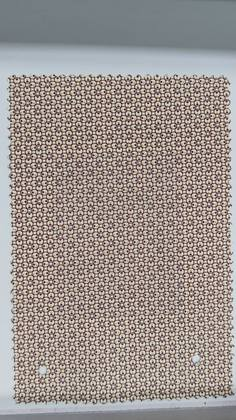](images/I-101.jpg) | [I-101.jpg](images/I-101.jpg) |
| `I-102` | Fabric | [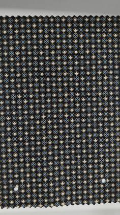](images/I-102.jpg) | [I-102.jpg](images/I-102.jpg) |
| `I-103` | Fabric | [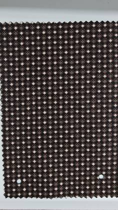](images/I-103.jpg) | [I-103.jpg](images/I-103.jpg) |
| `I-104` | Fabric | [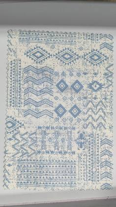](images/I-104.jpg) | [I-104.jpg](images/I-104.jpg) |
| `I-105` | Fabric | [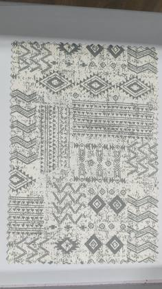](images/I-105.jpg) | [I-105.jpg](images/I-105.jpg) |
| `I-107` | Fabric | [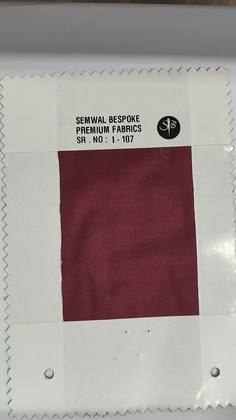](images/I-107.jpg) | [I-107.jpg](images/I-107.jpg) |
| `I-112` | Fabric |  | [I-112.jpg](images/I-112.jpg) |
| `I-115` | Fabric |  | [I-115.jpg](images/I-115.jpg) |
| `I-119` | Fabric |  | [I-119.jpg](images/I-119.jpg) |
| `I-127` | Fabric |  | [I-127.jpg](images/I-127.jpg) |
| `I-129` | Fabric |  | [I-129.jpg](images/I-129.jpg) |
| `I-131` | Fabric |  | [I-131.jpg](images/I-131.jpg) |
| `I-133` | Fabric |  | [I-133.jpg](images/I-133.jpg) |
| `I-135` | Fabric |  | [I-135.jpg](images/I-135.jpg) |
| `I-138` | Fabric |  | [I-138.jpg](images/I-138.jpg) |
| `I-144` | Fabric |  | [I-144.jpg](images/I-144.jpg) |
| `I-145` | Fabric |  | [I-145.jpg](images/I-145.jpg) |
| `I-147` | Fabric |  | [I-147.jpg](images/I-147.jpg) |
| `I-153` | Fabric |  | [I-153.jpg](images/I-153.jpg) |
| `I-155` | Fabric |  | [I-155.jpg](images/I-155.jpg) |
| `I-156` | Fabric |  | [I-156.jpg](images/I-156.jpg) |
| `I-157` | Fabric |  | [I-157.jpg](images/I-157.jpg) |
| `I-158` | Fabric |  | [I-158.jpg](images/I-158.jpg) |
| `I-159` | Fabric |  | [I-159.jpg](images/I-159.jpg) |
| `I-160` | Fabric |  | [I-160.jpg](images/I-160.jpg) |
| `I-162` | Fabric |  | [I-162.jpg](images/I-162.jpg) |
| `I-164` | Fabric |  | [I-164.jpg](images/I-164.jpg) |
| `I-165` | Fabric |  | [I-165.jpg](images/I-165.jpg) |
| `I-168` | Fabric |  | [I-168.jpg](images/I-168.jpg) |
| `I-169` | Fabric |  | [I-169.jpg](images/I-169.jpg) |
| `I-175` | Fabric |  | [I-175.jpg](images/I-175.jpg) |
| `I-176` | Fabric |  | [I-176.jpg](images/I-176.jpg) |
| `I-177` | Fabric |  | [I-177.jpg](images/I-177.jpg) |
| `I-178` | Fabric |  | [I-178.jpg](images/I-178.jpg) |
| `I-180` | Fabric |  | [I-180.jpg](images/I-180.jpg) |
| `I-182` | Fabric |  | [I-182.jpg](images/I-182.jpg) |
| `I-183` | Fabric |  | [I-183.jpg](images/I-183.jpg) |
| `I-184` | Fabric |  | [I-184.jpg](images/I-184.jpg) |
| `I-185` | Fabric |  | [I-185.jpg](images/I-185.jpg) |
| `I-186` | Fabric |  | [I-186.jpg](images/I-186.jpg) |
| `I-194` | Fabric |  | [I-194.jpg](images/I-194.jpg) |
| `I-196` | Fabric |  | [I-196.jpg](images/I-196.jpg) |
| `I-198` | Fabric |  | [I-198.jpg](images/I-198.jpg) |
| `I-203` | Fabric |  | [I-203.jpg](images/I-203.jpg) |
| `I-207` | Fabric |  | [I-207.jpg](images/I-207.jpg) |
| `I-210` | Fabric |  | [I-210.jpg](images/I-210.jpg) |
| `I-211` | Fabric |  | [I-211.jpg](images/I-211.jpg) |
| `I-212` | Fabric |  | [I-212.jpg](images/I-212.jpg) |
| `I-214` | Fabric |  | [I-214.jpg](images/I-214.jpg) |
| `I-215` | Fabric |  | [I-215.jpg](images/I-215.jpg) |
| `I-217` | Fabric |  | [I-217.jpg](images/I-217.jpg) |
| `I-219` | Fabric |  | [I-219.jpg](images/I-219.jpg) |
| `I-220` | Fabric |  | [I-220.jpg](images/I-220.jpg) |
| `I-222` | Fabric |  | [I-222.jpg](images/I-222.jpg) |
| `I-223` | Fabric |  | [I-223.jpg](images/I-223.jpg) |
| `I-224` | Fabric |  | [I-224.jpg](images/I-224.jpg) |
| `I-225` | Fabric |  | [I-225.jpg](images/I-225.jpg) |
| `I-227` | Fabric |  | [I-227.jpg](images/I-227.jpg) |
| `I-232` | Fabric |  | [I-232.jpg](images/I-232.jpg) |
| `I-234` | Fabric |  | [I-234.jpg](images/I-234.jpg) |
| `I-235` | Fabric |  | [I-235.jpg](images/I-235.jpg) |
| `I-236` | Fabric |  | [I-236.jpg](images/I-236.jpg) |
| `I-237` | Fabric |  | [I-237.jpg](images/I-237.jpg) |
| `I-239` | Fabric |  | [I-239.jpg](images/I-239.jpg) |
| `I-241` | Fabric |  | [I-241.jpg](images/I-241.jpg) |
| `I-242` | Fabric |  | [I-242.jpg](images/I-242.jpg) |
| `I-247` | Fabric |  | [I-247.jpg](images/I-247.jpg) |
| `I-248` | Fabric |  | [I-248.jpg](images/I-248.jpg) |
| `I-249` | Fabric |  | [I-249.jpg](images/I-249.jpg) |
| `I-251` | Fabric |  | [I-251.jpg](images/I-251.jpg) |
| `I-252` | Fabric |  | [I-252.jpg](images/I-252.jpg) |
| `I-254` | Fabric |  | [I-254.jpg](images/I-254.jpg) |
| `I-255` | Fabric |  | [I-255.jpg](images/I-255.jpg) |
| `I-256` | Fabric |  | [I-256.jpg](images/I-256.jpg) |
| `I-259` | Fabric |  | [I-259.jpg](images/I-259.jpg) |
| `I-261` | Fabric |  | [I-261.jpg](images/I-261.jpg) |
| `I-263` | Fabric |  | [I-263.jpg](images/I-263.jpg) |
| `I-265` | Fabric |  | [I-265.jpg](images/I-265.jpg) |
| `I-266` | Fabric |  | [I-266.jpg](images/I-266.jpg) |
| `I-267` | Fabric |  | [I-267.jpg](images/I-267.jpg) |
| `I-268` | Fabric |  | [I-268.jpg](images/I-268.jpg) |
| `I-269` | Fabric |  | [I-269.jpg](images/I-269.jpg) |
| `I-273` | Fabric |  | [I-273.jpg](images/I-273.jpg) |
| `I-274` | Fabric |  | [I-274.jpg](images/I-274.jpg) |
| `I-277` | Fabric |  | [I-277.jpg](images/I-277.jpg) |
| `I-278` | Fabric |  | [I-278.jpg](images/I-278.jpg) |
| `I-279` | Fabric |  | [I-279.jpg](images/I-279.jpg) |
| `I-280` | Fabric |  | [I-280.jpg](images/I-280.jpg) |
| `I-281` | Fabric |  | [I-281.jpg](images/I-281.jpg) |
| `I-282` | Fabric |  | [I-282.jpg](images/I-282.jpg) |
| `I-283` | Fabric |  | [I-283.jpg](images/I-283.jpg) |
| `I-284` | Fabric |  | [I-284.jpg](images/I-284.jpg) |
| `I-285` | Fabric |  | [I-285.jpg](images/I-285.jpg) |
| `I-286` | Fabric |  | [I-286.jpg](images/I-286.jpg) |
| `I-287` | Fabric |  | [I-287.jpg](images/I-287.jpg) |
| `I-288` | Fabric |  | [I-288.jpg](images/I-288.jpg) |
| `I-291` | Fabric |  | [I-291.jpg](images/I-291.jpg) |
| `I-292` | Fabric |  | [I-292.jpg](images/I-292.jpg) |
| `I-293` | Fabric |  | [I-293.jpg](images/I-293.jpg) |
| `I-294` | Fabric |  | [I-294.jpg](images/I-294.jpg) |
| `I-295` | Fabric |  | [I-295.jpg](images/I-295.jpg) |
| `I-296` | Fabric |  | [I-296.jpg](images/I-296.jpg) |
| `I-297` | Fabric |  | [I-297.jpg](images/I-297.jpg) |
| `I-298` | Fabric |  | [I-298.jpg](images/I-298.jpg) |
| `I-299` | Fabric |  | [I-299.jpg](images/I-299.jpg) |
| `I-300` | Fabric |  | [I-300.jpg](images/I-300.jpg) |
| `I-301` | Fabric |  | [I-301.jpg](images/I-301.jpg) |
| `I-302` | Fabric |  | [I-302.jpg](images/I-302.jpg) |
| `I-303` | Fabric |  | [I-303.jpg](images/I-303.jpg) |
| `I-306` | Fabric |  | [I-306.jpg](images/I-306.jpg) |
| `I-309` | Fabric |  | [I-309.jpg](images/I-309.jpg) |
| `I-310` | Fabric |  | [I-310.jpg](images/I-310.jpg) |
| `I-311` | Fabric |  | [I-311.jpg](images/I-311.jpg) |
| `I-313` | Fabric |  | [I-313.jpg](images/I-313.jpg) |
| `I-314` | Fabric |  | [I-314.jpg](images/I-314.jpg) |
| `I-315` | Fabric |  | [I-315.jpg](images/I-315.jpg) |
| `I-316` | Fabric |  | [I-316.jpg](images/I-316.jpg) |
| `I-317` | Fabric |  | [I-317.jpg](images/I-317.jpg) |
| `I-318` | Fabric |  | [I-318.jpg](images/I-318.jpg) |
| `I-320` | Fabric |  | [I-320.jpg](images/I-320.jpg) |
| `I-321` | Fabric |  | [I-321.jpg](images/I-321.jpg) |
| `I-322` | Fabric |  | [I-322.jpg](images/I-322.jpg) |
| `I-323` | Fabric |  | [I-323.jpg](images/I-323.jpg) |
| `I-324` | Fabric |  | [I-324.jpg](images/I-324.jpg) |
| `I-325` | Fabric |  | [I-325.jpg](images/I-325.jpg) |
| `I-326` | Fabric |  | [I-326.jpg](images/I-326.jpg) |
| `I-329` | Fabric |  | [I-329.jpg](images/I-329.jpg) |
| `I-333` | Fabric |  | [I-333.jpg](images/I-333.jpg) |
| `I-334` | Fabric |  | [I-334.jpg](images/I-334.jpg) |
| `I-336` | Fabric |  | [I-336.jpg](images/I-336.jpg) |
| `I-337` | Fabric |  | [I-337.jpg](images/I-337.jpg) |
| `I-338` | Fabric |  | [I-338.jpg](images/I-338.jpg) |
| `I-339` | Fabric |  | [I-339.jpg](images/I-339.jpg) |
| `I-340` | Fabric |  | [I-340.jpg](images/I-340.jpg) |
| `I-341` | Fabric |  | [I-341.jpg](images/I-341.jpg) |
| `I-342` | Fabric |  | [I-342.jpg](images/I-342.jpg) |
| `I-343` | Fabric |  | [I-343.jpg](images/I-343.jpg) |
| `I-346` | Fabric |  | [I-346.jpg](images/I-346.jpg) |
| `I-353` | Fabric |  | [I-353.jpg](images/I-353.jpg) |
| `I-354` | Fabric |  | [I-354.jpg](images/I-354.jpg) |
| `I-355` | Fabric |  | [I-355.jpg](images/I-355.jpg) |
| `I-356` | Fabric |  | [I-356.jpg](images/I-356.jpg) |
| `I-357` | Fabric |  | [I-357.jpg](images/I-357.jpg) |
| `I-358` | Fabric |  | [I-358.jpg](images/I-358.jpg) |
| `I-359` | Fabric |  | [I-359.jpg](images/I-359.jpg) |
| `I-360` | Fabric |  | [I-360.jpg](images/I-360.jpg) |
| `I-361` | Fabric |  | [I-361.jpg](images/I-361.jpg) |
| `I-362` | Fabric |  | [I-362.jpg](images/I-362.jpg) |
| `I-363` | Fabric |  | [I-363.jpg](images/I-363.jpg) |
| `I-364` | Fabric |  | [I-364.jpg](images/I-364.jpg) |
| `I-365` | Fabric |  | [I-365.jpg](images/I-365.jpg) |
| `I-366` | Fabric |  | [I-366.jpg](images/I-366.jpg) |
| `I-367` | Fabric |  | [I-367.jpg](images/I-367.jpg) |
| `I-368` | Fabric |  | [I-368.jpg](images/I-368.jpg) |
| `I-369` | Fabric |  | [I-369.jpg](images/I-369.jpg) |
| `I-370` | Fabric |  | [I-370.jpg](images/I-370.jpg) |
| `I-371` | Fabric |  | [I-371.jpg](images/I-371.jpg) |
| `I-372` | Fabric |  | [I-372.jpg](images/I-372.jpg) |
| `I-373` | Fabric |  | [I-373.jpg](images/I-373.jpg) |
| `I-374` | Fabric |  | [I-374.jpg](images/I-374.jpg) |
| `I-375` | Fabric |  | [I-375.jpg](images/I-375.jpg) |
| `I-376` | Fabric |  | [I-376.jpg](images/I-376.jpg) |
| `I-377` | Fabric |  | [I-377.jpg](images/I-377.jpg) |
| `I-378` | Fabric |  | [I-378.jpg](images/I-378.jpg) |
| `I-379` | Fabric |  | [I-379.jpg](images/I-379.jpg) |
| `I-380` | Fabric |  | [I-380.jpg](images/I-380.jpg) |
| `I-381` | Fabric |  | [I-381.jpg](images/I-381.jpg) |
| `I-382` | Fabric |  | [I-382.jpg](images/I-382.jpg) |
| `I-383` | Fabric |  | [I-383.jpg](images/I-383.jpg) |
| `I-384` | Fabric |  | [I-384.jpg](images/I-384.jpg) |
| `I-385` | Fabric |  | [I-385.jpg](images/I-385.jpg) |
| `I-386` | Fabric |  | [I-386.jpg](images/I-386.jpg) |
| `I-387` | Fabric |  | [I-387.jpg](images/I-387.jpg) |
| `I-388` | Fabric |  | [I-388.jpg](images/I-388.jpg) |
| `I-389` | Fabric |  | [I-389.jpg](images/I-389.jpg) |
| `I-390` | Fabric |  | [I-390.jpg](images/I-390.jpg) |
| `I-391` | Fabric |  | [I-391.jpg](images/I-391.jpg) |
| `I-392` | Fabric |  | [I-392.jpg](images/I-392.jpg) |
| `I-393` | Fabric |  | [I-393.jpg](images/I-393.jpg) |
| `I-394` | Fabric |  | [I-394.jpg](images/I-394.jpg) |
| `I-395` | Fabric |  | [I-395.jpg](images/I-395.jpg) |
| `I-396` | Fabric |  | [I-396.jpg](images/I-396.jpg) |
| `I-397` | Fabric |  | [I-397.jpg](images/I-397.jpg) |
| `I-398` | Fabric |  | [I-398.jpg](images/I-398.jpg) |
| `I-399` | Fabric |  | [I-399.jpg](images/I-399.jpg) |
| `I-400` | Fabric |  | [I-400.jpg](images/I-400.jpg) |
| `I-401` | Fabric |  | [I-401.jpg](images/I-401.jpg) |
| `I-402` | Fabric |  | [I-402.jpg](images/I-402.jpg) |
| `I-403` | Fabric |  | [I-403.jpg](images/I-403.jpg) |
| `I-404` | Fabric |  | [I-404.jpg](images/I-404.jpg) |
| `I-405` | Fabric |  | [I-405.jpg](images/I-405.jpg) |
| `I-406` | Fabric |  | [I-406.jpg](images/I-406.jpg) |
| `I-407` | Fabric |  | [I-407.jpg](images/I-407.jpg) |
| `I-408` | Fabric |  | [I-408.jpg](images/I-408.jpg) |
| `I-409` | Fabric |  | [I-409.jpg](images/I-409.jpg) |
| `I-410` | Fabric |  | [I-410.jpg](images/I-410.jpg) |
| `I-411` | Fabric |  | [I-411.jpg](images/I-411.jpg) |
| `I-412` | Fabric |  | [I-412.jpg](images/I-412.jpg) |
| `I-413` | Fabric |  | [I-413.jpg](images/I-413.jpg) |
| `I-414` | Fabric |  | [I-414.jpg](images/I-414.jpg) |
| `I-415` | Fabric |  | [I-415.jpg](images/I-415.jpg) |
| `I-416` | Fabric |  | [I-416.jpg](images/I-416.jpg) |
| `I-417` | Fabric |  | [I-417.jpg](images/I-417.jpg) |
| `I-418` | Fabric |  | [I-418.jpg](images/I-418.jpg) |
| `I-419` | Fabric |  | [I-419.jpg](images/I-419.jpg) |
| `I-420` | Fabric |  | [I-420.jpg](images/I-420.jpg) |
| `I-421` | Fabric |  | [I-421.jpg](images/I-421.jpg) |
| `I-422` | Fabric |  | [I-422.jpg](images/I-422.jpg) |
| `I-423` | Fabric |  | [I-423.jpg](images/I-423.jpg) |
| `I-424` | Fabric |  | [I-424.jpg](images/I-424.jpg) |
| `I-425` | Fabric |  | [I-425.jpg](images/I-425.jpg) |
| `I-426` | Fabric |  | [I-426.jpg](images/I-426.jpg) |
| `I-427` | Fabric |  | [I-427.jpg](images/I-427.jpg) |
| `I-428` | Fabric |  | [I-428.jpg](images/I-428.jpg) |
| `I-429` | Fabric |  | [I-429.jpg](images/I-429.jpg) |
| `I-430` | Fabric |  | [I-430.jpg](images/I-430.jpg) |
| `I-431` | Fabric |  | [I-431.jpg](images/I-431.jpg) |
| `I-432` | Fabric |  | [I-432.jpg](images/I-432.jpg) |
| `I-433` | Fabric |  | [I-433.jpg](images/I-433.jpg) |
| `I-434` | Fabric |  | [I-434.jpg](images/I-434.jpg) |
| `I-435` | Fabric |  | [I-435.jpg](images/I-435.jpg) |
| `I-436` | Fabric |  | [I-436.jpg](images/I-436.jpg) |
| `I-437` | Fabric |  | [I-437.jpg](images/I-437.jpg) |
| `I-438` | Fabric |  | [I-438.jpg](images/I-438.jpg) |
| `I-439` | Fabric |  | [I-439.jpg](images/I-439.jpg) |
| `I-440` | Fabric |  | [I-440.jpg](images/I-440.jpg) |
| `I-441` | Fabric |  | [I-441.jpg](images/I-441.jpg) |
| `I-442` | Fabric |  | [I-442.jpg](images/I-442.jpg) |
| `I-443` | Fabric |  | [I-443.jpg](images/I-443.jpg) |
| `I-444` | Fabric |  | [I-444.jpg](images/I-444.jpg) |
| `I-445` | Fabric |  | [I-445.jpg](images/I-445.jpg) |
| `I-446` | Fabric |  | [I-446.jpg](images/I-446.jpg) |
| `I-447` | Fabric |  | [I-447.jpg](images/I-447.jpg) |
| `I-448` | Fabric |  | [I-448.jpg](images/I-448.jpg) |
| `I-449` | Fabric |  | [I-449.jpg](images/I-449.jpg) |
| `I-450` | Fabric |  | [I-450.jpg](images/I-450.jpg) |
| `I-451` | Fabric |  | [I-451.jpg](images/I-451.jpg) |
| `I-452` | Fabric |  | [I-452.jpg](images/I-452.jpg) |
| `I-453` | Fabric |  | [I-453.jpg](images/I-453.jpg) |
| `I-454` | Fabric |  | [I-454.jpg](images/I-454.jpg) |
| `I-455` | Fabric |  | [I-455.jpg](images/I-455.jpg) |
| `I-456` | Fabric |  | [I-456.jpg](images/I-456.jpg) |
| `I-457` | Fabric |  | [I-457.jpg](images/I-457.jpg) |
| `I-458` | Fabric |  | [I-458.jpg](images/I-458.jpg) |
| `I-459` | Fabric |  | [I-459.jpg](images/I-459.jpg) |
| `I-460` | Fabric |  | [I-460.jpg](images/I-460.jpg) |
| `I-461` | Fabric |  | [I-461.jpg](images/I-461.jpg) |
| `I-462` | Fabric |  | [I-462.jpg](images/I-462.jpg) |
| `PI-502` | Premium / PI |  | [PI-502.jpg](images/PI-502.jpg) |
| `PI-503` | Premium / PI |  | [PI-503.jpg](images/PI-503.jpg) |
| `PI-504` | Premium / PI |  | [PI-504.jpg](images/PI-504.jpg) |
| `PI-506` | Premium / PI |  | [PI-506.jpg](images/PI-506.jpg) |
| `PI-509` | Premium / PI |  | [PI-509.jpg](images/PI-509.jpg) |
| `PI-514` | Premium / PI |  | [PI-514.jpg](images/PI-514.jpg) |
| `PI-515` | Premium / PI |  | [PI-515.jpg](images/PI-515.jpg) |
| `PI-517` | Premium / PI |  | [PI-517.jpg](images/PI-517.jpg) |
| `PI-522` | Premium / PI |  | [PI-522.jpg](images/PI-522.jpg) |
| `PI-524` | Premium / PI |  | [PI-524.jpg](images/PI-524.jpg) |
| `PI-526` | Premium / PI |  | [PI-526.jpg](images/PI-526.jpg) |
| `PI-528` | Premium / PI |  | [PI-528.jpg](images/PI-528.jpg) |
| `PI-529` | Premium / PI |  | [PI-529.jpg](images/PI-529.jpg) |
| `PI-530` | Premium / PI |  | [PI-530.jpg](images/PI-530.jpg) |
| `PI-531` | Premium / PI |  | [PI-531.jpg](images/PI-531.jpg) |
